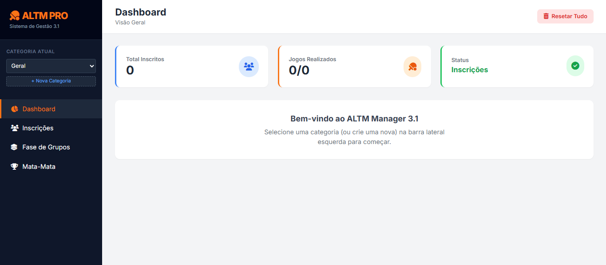

# ALTM Manager Pro 3.1 | Sistema de Gestão de Torneios

## 📸 Preview do Projeto

Sistema web desenvolvido para **gestão completa de torneios esportivos**, com controle de inscrições, fase de grupos, mata-mata, lançamento de resultados e geração de relatórios.  
O projeto encontra-se **em fase de testes**, sendo utilizado para validação funcional em ambiente real.

---

## 🎯 Objetivo do Projeto
Desenvolver uma aplicação front-end robusta capaz de:
- Gerenciar atletas por categorias  
- Automatizar sorteio de grupos (sistema Snake)  
- Controlar resultados da fase de grupos  
- Gerar chave eliminatória automaticamente  
- Acompanhar progresso do torneio em tempo real  
- Exportar jogos em PDF  

---

## 🧠 Visão Técnica (Arquitetura)
O sistema foi desenvolvido utilizando **JavaScript Vanilla**, com gerenciamento de estado customizado e persistência local via **LocalStorage**, sem dependência de frameworks front-end.

Principais conceitos aplicados:
- Gerenciamento de estado centralizado  
- Renderização dinâmica do DOM  
- Separação lógica entre UI, estado e regras de negócio  
- Persistência de dados no navegador  
- Geração dinâmica de chaves eliminatórias  
- Algoritmo de distribuição Snake Draft  
- Tratamento de erros em tempo de execução  

---

## ⚙️ Funcionalidades Principais
- Cadastro e gerenciamento de categorias  
- Inscrição e remoção de atletas  
- Sorteio automático de grupos  
- Cálculo de classificação (vitórias, saldo de sets)  
- Lançamento de resultados via modal  
- Geração automática do mata-mata  
- Avanço automático de vencedores  
- Exportação de jogos da fase de grupos em PDF  
- Interface responsiva e intuitiva  

---

## 🚀 Tecnologias Utilizadas
- HTML5  
- CSS3  
- JavaScript (Vanilla JS)   
- Font Awesome  
- jsPDF  
- LocalStorage (persistência de dados)  
- Git e GitHub  

---

## 📱 Interface e UX
- Layout responsivo (desktop e mobile)  
- Dashboard com indicadores do torneio  
- Feedback visual por status (cores e badges)  
- Notificações Toast para ações do usuário  
- Navegação organizada por etapas do torneio  

---

## 📊 Status do Projeto
🧪 **Em fase de testes**  

O sistema está sendo utilizado para validação funcional e continuará recebendo melhorias, como:
- Refatoração modular do JavaScript  
- Otimização de regras de negócio  
- Evolução da arquitetura para possível backend  
- Novos relatórios e exportações  

---

## 👨‍💻 Desenvolvedor
Projeto desenvolvido por **Diogo José Morais Netto**,  
Desenvolvedor **Front-End**, com foco em aplicações web, sistemas interativos e soluções personalizadas.

---

